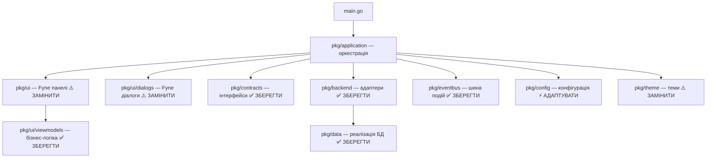

# 🔄 План міграції Fyne UI → Qt (miqt)
## АРМ Пожежної Безпеки — obj_catalog_fyne_v3

---

## 📊 Аналіз поточного стану проекту

### Що це за додаток
Десктопний додаток для моніторингу пожежної безпеки об'єктів. Каталог об'єктів, тривоги в реальному часі, журнал подій, адміністрування SIM-карт та обладнання. Джерела даних: Firebird DB (MOST-P), CASL Cloud API, Phoenix.

### Архітектура (вже добре структурована!)



### Масштаб UI-шару (що треба мігрувати)

| Компонент | Файлів | Рядків (≈) | Складність |
|-----------|--------|------------|------------|
| [pkg/ui/](file:///D:/goproject/obj_catalog_fyne_v3/pkg/ui) — панелі | 9 Go файлів | ~3 700 | 🟡 Середня |
| [pkg/ui/dialogs/](file:///D:/goproject/obj_catalog_fyne_v3/pkg/ui/dialogs) — діалоги | 47 Go файлів | ~15 000+ | 🔴 Висока |
| [pkg/application/](file:///D:/goproject/obj_catalog_fyne_v3/pkg/application) — оркестрація | 16 Go файлів | ~3 500 | 🟡 Середня |
| [pkg/theme/](file:///D:/goproject/obj_catalog_fyne_v3/pkg/theme) — теми | ~2 файли | ~300 | 🟢 Низька |
| [pkg/config/](file:///D:/goproject/obj_catalog_fyne_v3/pkg/config) — конфіг (fyne.Preferences) | 2 файли | ~400 | 🟢 Низька |

### Що ПОВНІСТЮ зберігається без змін (~1200+ KB коду)

| Пакет | Файлів | Розмір | Опис |
|-------|--------|--------|------|
| [pkg/contracts/](file:///D:/goproject/obj_catalog_fyne_v3/pkg/contracts) | 14 | ~50 KB | Інтерфейси, DTO |
| [pkg/models/](file:///D:/goproject/obj_catalog_fyne_v3/pkg/models) | 6 | ~24 KB | Моделі даних |
| [pkg/data/](file:///D:/goproject/obj_catalog_fyne_v3/pkg/data) | 54 | ~500+ KB | Реалізація БД, CASL, Phoenix |
| [pkg/backend/](file:///D:/goproject/obj_catalog_fyne_v3/pkg/backend) | 20 | ~200+ KB | Адаптери frontend/admin |
| [pkg/ui/viewmodels/](file:///D:/goproject/obj_catalog_fyne_v3/pkg/ui/viewmodels) | 96 | ~300 KB | ViewModels (96 файлів!) |
| [pkg/eventbus/](file:///D:/goproject/obj_catalog_fyne_v3/pkg/eventbus) | 3 | ~5 KB | Шина подій (3 топіки) |
| [pkg/usecases/](file:///D:/goproject/obj_catalog_fyne_v3/pkg/usecases) | 6 | ~6 KB | Бізнес-логіка |
| [pkg/export/](file:///D:/goproject/obj_catalog_fyne_v3/pkg/export) | — | — | PDF/XLSX експорт |
| [pkg/config/](file:///D:/goproject/obj_catalog_fyne_v3/pkg/config) | 11 | ~33 KB | Конфігурація (Preferences вже абстраговано!) |
| [pkg/frontendapi/](file:///D:/goproject/obj_catalog_fyne_v3/pkg/frontendapi) | 4 | ~33 KB | REST API DTOs (v1) |
| [pkg/frontendhttp/](file:///D:/goproject/obj_catalog_fyne_v3/pkg/frontendhttp) | 2 | ~36 KB | HTTP handler |
| [pkg/dataruntime/](file:///D:/goproject/obj_catalog_fyne_v3/pkg/dataruntime) | 1 | — | Headless runtime (доказ незалежності) |

---

## 🎨 Концепція нового Qt UI

### Дизайн-принципи

> [!IMPORTANT]
> Новий UI має бути: **сучасний**, **зручний**, **інформативний**, **не перевантажений**, **добре структурований**, **зрозумілий для новачків**.

### Порівняння Fyne → Qt підхід

| Аспект | Fyne (зараз) | Qt/miqt (нове) |
|--------|-------------|----------------|
| Списки | `widget.List` з ручним binding | `QTableView` + `QStandardItemModel` |
| Таблиці | `widget.Table` (обмежений) | `QTableView` з сортуванням, ресайзом колонок |
| Вкладки | `container.AppTabs` | `QTabWidget` з іконками |
| Split-панелі | `container.HSplit/VSplit` | `QSplitter` (з persistence) |
| Діалоги | `dialog.ShowCustom` | `QDialog` / `QWizard` |
| Дерева | ❌ Немає | `QTreeView` для ієрархій |
| Меню | `fyne.MainMenu` | `QMenuBar` + `QToolBar` |
| Статус-бар | Вручну Labels | `QStatusBar` з секціями |
| Стилізація | Custom Theme struct | Qt StyleSheet (QSS) |
| Іконки | Fyne theme icons | Qt theme icons / SVG |
| Пошук | `widget.Entry` | `QLineEdit` з `QCompleter` |
| Tooltips | Обмежені | Повноцінні `QToolTip` |

### Макет головного вікна (нова структура)

```
┌─────────────────────────────────────────────────────────────────┐
│ 🔧 Toolbar: [Налаштування] [Тема] [Експорт] [Допомога]  │ v1.2 │
├───────────────┬─────────────────────────────────────────────────┤
│               │ ┌─ QTabWidget ──────────────────────────────┐   │
│  📋 Список    │ │ [📊 Картка] [🗺 Зони] [👥 Контакти]      │   │
│  об'єктів     │ │ [📜 Журнал] [📤 Експорт]                  │   │
│               │ │                                            │   │
│  QTableView   │ │   Вміст обраної вкладки                    │   │
│  + пошук      │ │                                            │   │
│  + фільтри    │ │                                            │   │
│               │ └────────────────────────────────────────────┘   │
│               │                                                  │
├───────────────┴──────────────────────────────────────────────────┤
│ ┌─ QTabWidget (нижня панель) ──────────────────────────────────┐ │
│ │ [🚨 Тривоги (5)] [📜 Журнал подій]                          │ │
│ │                                                              │ │
│ │  Вміст                                                       │ │
│ └──────────────────────────────────────────────────────────────┘ │
├──────────────────────────────────────────────────────────────────┤
│ StatusBar: 🟢 БД: підключено | Phoenix: підключено | Ctrl+F    │
└──────────────────────────────────────────────────────────────────┘
```

### UX-покращення при міграції

1. **Нативне відчуття** — Qt віджети виглядають як рідні компоненти Windows
2. **Сортування в таблицях** — клік по заголовку колонки (Fyne не підтримує)
3. **Контекстне меню** — правий клік на об'єкті/тривозі
4. **Drag & resize колонок** — нативна поведінка `QTableView`
5. **QWizard** для майстрів створення — замість ручної реалізації кроків
6. **QSystemTrayIcon** — мінімізація в трей з нотифікаціями тривог
7. **QDockWidget** — можливість відкріпити панелі (журнал, тривоги)
8. **QToolTip** — підказки для всіх елементів (дуже корисно для новачків!)
9. **QShortcut** — стандартна система хоткеїв
10. **QSettings** — нативне збереження налаштувань (замість fyne.Preferences)

---

## 🗂 Нова структура пакетів

```
pkg/
├── contracts/          # ✅ БЕЗ ЗМІН — інтерфейси
├── models/             # ✅ БЕЗ ЗМІН — моделі даних
├── data/               # ✅ БЕЗ ЗМІН — робота з БД
├── backend/            # ✅ БЕЗ ЗМІН — адаптери
├── eventbus/           # ✅ БЕЗ ЗМІН — шина подій
├── usecases/           # ✅ БЕЗ ЗМІН — бізнес-логіка
├── export/             # ✅ БЕЗ ЗМІН — PDF/XLSX
├── config/             # ⚡ АДАПТУВАТИ — QSettings замість fyne.Preferences
│   ├── db_config.go         # змінити interface збереження
│   └── ui_config.go         # змінити interface збереження
├── ui/
│   ├── viewmodels/     # ✅ ЗБЕРЕГТИ — чисті viewmodels (96 файлів)
│   └── fyne/           # 🗄 АРХІВ — старий Fyne UI (для довідки)
├── qtui/               # 🆕 НОВИЙ Qt UI
│   ├── app.go               # QApplication + QMainWindow
│   ├── mainwindow.go        # Головне вікно, layout, меню
│   ├── theme.go             # QSS стилі (темна/світла тема)
│   ├── resources.go         # Вбудовані ресурси (іконки, QSS)
│   ├── panels/              # Панелі
│   │   ├── object_list.go        # QTableView з пошуком
│   │   ├── alarm_panel.go        # Панель тривог
│   │   ├── event_log.go          # Журнал подій
│   │   └── work_area.go          # Робоча область (вкладки)
│   ├── dialogs/             # Діалоги
│   │   ├── settings.go           # Налаштування
│   │   ├── process_alarm.go      # Обробка тривоги
│   │   ├── object_card.go        # Картка об'єкта
│   │   ├── object_wizard.go      # QWizard створення об'єкта
│   │   ├── sim_management.go     # SIM керування
│   │   ├── statistics.go         # Статистика
│   │   ├── casl_editor.go        # CASL редактор
│   │   └── ...
│   └── widgets/             # Кастомні віджети
│       ├── colored_table.go      # Таблиця з кольоровими рядками
│       ├── status_indicator.go   # Індикатори стану
│       ├── badge_tab.go          # Вкладка з бейджем кількості
│       └── search_bar.go         # Панель пошуку з фільтрами
└── qtapp/              # 🆕 НОВИЙ Application orchestration
    ├── application.go        # Оркестрація (замість pkg/application)
    ├── coordinator.go        # Координація між панелями
    ├── refresh_scheduler.go  # Планувальник оновлень (reuse логіки)
    └── shortcuts.go          # Гарячі клавіші
```

---

## 📋 Поетапний план міграції

### Фаза 0: Підготовка (1–2 дні)

> [!TIP]
> Ця фаза не змінює жодного існуючого коду. Безпечна відправна точка.

| # | Задача | Деталі |
|---|--------|--------|
| 0.1 | Встановити miqt + Qt toolchain | `go get github.com/mappu/miqt@latest`, встановити Qt 6 SDK |
| 0.2 | Створити "hello world" з miqt | Перевірити компіляцію, QMainWindow + QLabel |
| 0.3 | Реалізувати `config.Preferences` для Qt | ✅ Інтерфейс [Preferences](file:///D:/goproject/obj_catalog_fyne_v3/pkg/config/preferences.go) **вже існує!** Потрібен лише `QtPreferences` адаптер |
| 0.4 | Перевірити viewmodels на чистоту | Переконатись що viewmodels не імпортують `fyne.io/*` |
| 0.5 | Створити структуру `pkg/qtui/` | Порожні файли, базові скелети |

**Задача 0.3 — Реалізувати Qt адаптер для config.Preferences:**

> [!TIP]
> Чудова новина! [config.Preferences](file:///D:/goproject/obj_catalog_fyne_v3/pkg/config/preferences.go) — **вже абстрагований інтерфейс**! Fyne не імпортується в `pkg/config`. Потрібно лише створити один файл:

```go
// Інтерфейс вже існує (pkg/config/preferences.go):
type Preferences interface {
    BoolWithFallback(key string, fallback bool) bool
    FloatWithFallback(key string, fallback float64) float64
    IntWithFallback(key string, fallback int) int
    String(key string) string
    StringWithFallback(key string, fallback string) string
    SetBool(key string, value bool)
    SetFloat(key string, value float64)
    SetInt(key string, value int)
    SetString(key string, value string)
}

// pkg/config/qt_preferences.go — НОВИЙ (єдиний файл!)
type QtPreferences struct {
    settings *core.QSettings
}

func NewQtPreferences(org, app string) *QtPreferences {
    return &QtPreferences{settings: core.NewQSettings2(org, app)}
}

func (p *QtPreferences) String(key string) string {
    v := p.settings.Value(key)
    return v.ToString()
}

func (p *QtPreferences) SetString(key, value string) {
    p.settings.SetValue(key, core.NewQVariant14(value))
}
// ... інші методи аналогічно
```

> [!IMPORTANT]
> Додаткове відкриття: `pkg/dataruntime` вже реалізує **headless запуск backend без GUI**.
> Це підтверджує, що backend повністю незалежний від Fyne і готовий до нового UI.
```

---

### Фаза 1: Каркас головного вікна (3–5 днів)

| # | Задача | Деталі |
|---|--------|--------|
| 1.1 | `pkg/qtui/app.go` | QApplication, ініціалізація |
| 1.2 | `pkg/qtui/mainwindow.go` | QMainWindow з QMenuBar, QToolBar, QStatusBar |
| 1.3 | `pkg/qtui/theme.go` | QSS стилі темної/світлої теми |
| 1.4 | Skeleton layout | QSplitter (left/right), QSplitter (top/bottom) |
| 1.5 | Placeholder панелі | QLabel-заглушки замість реальних панелей |
| 1.6 | QMenuBar | Перенести структуру меню з `buildMainMenu()` |
| 1.7 | QStatusBar | Статус підключення, хоткеї |
| 1.8 | QSettings integration | Збереження розмірів вікна, split offsets |

**Приклад коду (1.1 + 1.2):**

```go
// pkg/qtui/app.go
package qtui

import (
    "github.com/mappu/miqt/qt6"
    "github.com/mappu/miqt/qt6/widgets"
)

type App struct {
    qapp       *widgets.QApplication
    mainWindow *MainWindow
}

func NewApp() *App {
    qapp := widgets.NewQApplication(0, nil)
    qapp.SetApplicationName("Каталог об'єктів")
    qapp.SetOrganizationName("MOST")
    
    app := &App{qapp: qapp}
    app.mainWindow = NewMainWindow(app)
    return app
}

func (a *App) Run() {
    a.mainWindow.Show()
    a.qapp.Exec()
}
```

```go
// pkg/qtui/mainwindow.go
package qtui

import (
    "github.com/mappu/miqt/qt6/widgets"
    "github.com/mappu/miqt/qt6/core"
)

type MainWindow struct {
    *widgets.QMainWindow
    
    // Layout
    centralSplitter *widgets.QSplitter
    mainSplitter    *widgets.QSplitter
    
    // Panels
    objectList  *ObjectListPanel
    workArea    *WorkAreaPanel
    alarmPanel  *AlarmPanel
    eventLog    *EventLogPanel
    
    // StatusBar items
    statusLabel *widgets.QLabel
}

func NewMainWindow(app *App) *MainWindow {
    mw := &MainWindow{
        QMainWindow: widgets.NewQMainWindow(nil, 0),
    }
    mw.SetWindowTitle("Каталог об'єктів")
    mw.Resize2(1280, 900)
    
    mw.buildMenuBar()
    mw.buildToolBar()
    mw.buildStatusBar()
    mw.buildLayout()
    
    return mw
}
```

---

### Фаза 2: Панель списку об'єктів (3–4 дні)

> [!NOTE]
> Це перша "реальна" панель. Після неї стане зрозуміло, як мігрувати решту.

| # | Задача | Деталі |
|---|--------|--------|
| 2.1 | `pkg/qtui/panels/object_list.go` | QTableView + QStandardItemModel |
| 2.2 | Пошук з debounce | QLineEdit + QTimer (250ms debounce) |
| 2.3 | Фільтри | QComboBox для фільтра стану та джерела |
| 2.4 | Кольорові рядки | Custom QStyledItemDelegate або фонові ролі |
| 2.5 | Клавіатурна навігація | QShortcut + selection model |
| 2.6 | Контекстне меню | QMenu з правого кліку |
| 2.7 | Інтеграція з ViewModel | Підключити `viewmodels.ObjectListViewModel` |

**Маппінг Fyne → Qt для ObjectListPanel:**

```diff
- widget.Table             → QTableView + QSortFilterProxyModel
- widget.Entry (search)    → QLineEdit з placeholder + clear button
- widget.Select (filter)   → QComboBox
- binding.UntypedList      → QStandardItemModel
- canvas.Text (colored)    → QStandardItem з Qt.BackgroundRole
- custom keyboard handler  → QShortcut / keyPressEvent override
```

---

### Фаза 3: Панель тривог (3–4 дні)

| # | Задача | Деталі |
|---|--------|--------|
| 3.1 | `pkg/qtui/panels/alarm_panel.go` | QTableView для тривог |
| 3.2 | Кольорова індикація severity | QStyledItemDelegate з кольоровим фоном |
| 3.3 | Подвійний клік | QAbstractItemView.doubleClicked signal |
| 3.4 | Кнопка "Відпрацювати" | QPushButton в toolbar панелі |
| 3.5 | Фільтр джерела | QComboBox |
| 3.6 | Case history section | QGroupBox / QTreeWidget (складний) |
| 3.7 | Звукові сповіщення | QSystemTrayIcon.showMessage + QSound |
| 3.8 | Badge-лічильник | Кастомний QTabWidget з бейджем |

---

### Фаза 4: Робоча область (5–7 днів)

> [!WARNING]
> Найбільший компонент! [work_area.go](file:///D:/goproject/obj_catalog_fyne_v3/pkg/ui/work_area.go) — 1451 рядок. Розбити на підкомпоненти.

| # | Задача | Деталі |
|---|--------|--------|
| 4.1 | Каркас QTabWidget | 5 вкладок з іконками |
| 4.2 | Summary tab | QGroupBox-и для секцій стану пристрою |
| 4.3 | Zones tab | QTableView для зон |
| 4.4 | Contacts tab | QTableView з кнопками "копіювати телефон" |
| 4.5 | Events tab (контекстний) | QTableView подій обраного об'єкта |
| 4.6 | Export tab | QPushButton-и для PDF/XLSX/Clipboard |
| 4.7 | Кольорові індикатори стану | Кастомний віджет або QSS styled QFrame |
| 4.8 | Header (назва + адреса) | QLabel-и зі стилями |

**Декомпозиція work_area на підкомпоненти Qt:**

```
pkg/qtui/panels/work_area.go           — Контейнер з QTabWidget
pkg/qtui/panels/work_area_summary.go   — Вкладка "Зведення" (стан пристрою)
pkg/qtui/panels/work_area_zones.go     — Вкладка "Зони"
pkg/qtui/panels/work_area_contacts.go  — Вкладка "Контакти"
pkg/qtui/panels/work_area_events.go    — Вкладка "Журнал подій"
pkg/qtui/panels/work_area_export.go    — Вкладка "Експорт"
```

---

### Фаза 5: Журнал подій (2–3 дні)

| # | Задача | Деталі |
|---|--------|--------|
| 5.1 | `pkg/qtui/panels/event_log.go` | QTableView з кольоровими рядками |
| 5.2 | Пауза/продовження | QPushButton toggle |
| 5.3 | Фільтри (час, джерело, важливість) | QComboBox + QCheckBox |
| 5.4 | Контекстний режим | Перемикач "всі / по об'єкту" |
| 5.5 | Авто-прокрутка | QTableView.scrollToBottom |

---

### Фаза 6: Оркестрація додатку (3–4 дні)

| # | Задача | Деталі |
|---|--------|--------|
| 6.1 | `pkg/qtapp/application.go` | Ініціалізація, wiring панелей |
| 6.2 | Callbacks між панелями | Qt signals/slots або Go callbacks |
| 6.3 | EventBus bridge | Підключити eventbus до Qt panels |
| 6.4 | Refresh scheduler | Перенести logic з мінімальними змінами |
| 6.5 | Keyboard shortcuts | QShortcut для Ctrl+1..3, Ctrl+T, Ctrl+F |
| 6.6 | Window lifecycle | closeEvent, saveGeometry/restoreGeometry |
| 6.7 | System tray | QSystemTrayIcon для фонових тривог |

---

### Фаза 7: Базові діалоги (5–7 днів)

| # | Діалог | Пріоритет | Qt еквівалент |
|---|--------|-----------|---------------|
| 7.1 | Налаштування | 🔴 Критичний | QDialog з QTabWidget |
| 7.2 | Обробка тривоги | 🔴 Критичний | QDialog |
| 7.3 | Тестові повідомлення | 🟡 Важливий | QDialog |
| 7.4 | Колір подій | 🟡 Важливий | QColorDialog |

---

### Фаза 8: Адміністративні діалоги (7–14 днів)

> [!CAUTION]
> Це найбільший обсяг роботи. [casl_object_editor.go](file:///D:/goproject/obj_catalog_fyne_v3/pkg/ui/dialogs/casl_object_editor.go) — **113 KB**, один файл! Потрібна декомпозиція.

| # | Діалог | Розмір | Qt еквівалент |
|---|--------|--------|---------------|
| 8.1 | Картка об'єкта | 22KB | QDialog з QFormLayout |
| 8.2 | Майстер створення об'єкта | 31KB | **QWizard** (нативний!) |
| 8.3 | CASL редактор | 113KB | QMainWindow або QDockWidget |
| 8.4 | Статистика | 18KB | QDialog з QTableView |
| 8.5 | SIM керування (Kyivstar) | 10KB | QDialog |
| 8.6 | SIM керування (Vodafone) | 8KB | QDialog |
| 8.7 | Карта координат | 28KB | QDialog + QWebEngineView |
| 8.8 | Геокодування | 17KB | QDialog |
| 8.9 | Пожежний моніторинг | 11KB | QDialog |
| 8.10 | Словники | 11KB | QDialog + QTableView |
| 8.11 | Системне управління | 11KB | QDialog |
| 8.12 | Конструктори (220V, ППК) | 17KB | QDialog з QFormLayout |
| 8.13 | Емуляція подій | 9KB | QDialog |
| 8.14 | Override подій | 10KB | QDialog |
| 8.15 | Блокування відображення | 8KB | QDialog |
| 8.16 | SIM inventory report | 6KB | QDialog |

---

### Фаза 9: Полірування та тестування (3–5 днів)

| # | Задача |
|---|--------|
| 9.1 | Тестування всіх flows end-to-end |
| 9.2 | Перевірка HiDPI / масштабування |
| 9.3 | Оптимізація розміру бінарника (`-ldflags "-s -w"` + upx) |
| 9.4 | Перевірка memory leaks (Qt parent-child) |
| 9.5 | Документація для користувачів |
| 9.6 | Видалення старого Fyne коду |

---

## 🔧 Технічні рішення

### 1. Config Store — абстракція від Fyne Preferences

```go
// Поточний код (Fyne):
dbCfg := config.LoadDBConfig(fyneApp.Preferences())

// Новий код (Qt):
settings := core.NewQSettings2("MOST", "ObjCatalog")
store := config.NewQtConfigStore(settings)
dbCfg := config.LoadDBConfig(store)
```

### 2. Кольорова таблиця — QStyledItemDelegate

```go
// Кастомний делегат для кольорових рядків у таблицях
type ColoredRowDelegate struct {
    widgets.QStyledItemDelegate
}

// Використання Qt ролей для кольору:
// Qt.BackgroundRole — фон рядка
// Qt.ForegroundRole — колір тексту
// Qt.FontRole — жирний для критичних
```

### 3. Маппінг Fyne Layout → Qt Layout

| Fyne | Qt |
|------|-----|
| `container.NewHBox` | `QHBoxLayout` |
| `container.NewVBox` | `QVBoxLayout` |
| `container.NewBorder` | `QGridLayout` або `QMainWindow` regions |
| `container.NewHSplit` | `QSplitter(Qt.Horizontal)` |
| `container.NewVSplit` | `QSplitter(Qt.Vertical)` |
| `container.NewAppTabs` | `QTabWidget` |
| `layout.NewSpacer()` | `QSpacerItem` або `addStretch()` |
| `container.NewGridWrap` | `QGridLayout` |

### 4. Маппінг Fyne Widget → Qt Widget

| Fyne | Qt |
|------|-----|
| `widget.Label` | `QLabel` |
| `widget.Button` | `QPushButton` |
| `widget.Entry` | `QLineEdit` / `QTextEdit` |
| `widget.Select` | `QComboBox` |
| `widget.Check` | `QCheckBox` |
| `widget.List` | `QListView` + model |
| `widget.Table` | `QTableView` + model |
| `widget.Accordion` | `QToolBox` або кастомний |
| `widget.Separator` | `QFrame` з HLine |
| `canvas.Text` | `QLabel` з QSS |
| `canvas.Rectangle` | `QFrame` з QSS background |
| `dialog.ShowCustom` | `QDialog` |
| `dialog.ShowConfirm` | `QMessageBox.Question` |
| `dialog.ShowInformation` | `QMessageBox.Information` |

### 5. Тема QSS (темна)

```css
/* pkg/qtui/resources/dark_theme.qss */
QMainWindow {
    background-color: #1e1e2e;
    color: #cdd6f4;
}

QTableView {
    background-color: #1e1e2e;
    alternate-background-color: #252535;
    color: #cdd6f4;
    gridline-color: #313244;
    selection-background-color: #45475a;
    border: 1px solid #313244;
    border-radius: 4px;
}

QTableView::item:selected {
    background-color: #45475a;
    color: #cdd6f4;
}

QTabWidget::pane {
    border: 1px solid #313244;
    border-radius: 4px;
    background-color: #1e1e2e;
}

QTabBar::tab {
    background-color: #181825;
    color: #a6adc8;
    padding: 8px 16px;
    border-top-left-radius: 4px;
    border-top-right-radius: 4px;
    margin-right: 2px;
}

QTabBar::tab:selected {
    background-color: #1e1e2e;
    color: #cdd6f4;
    border-bottom: 2px solid #89b4fa;
}

QPushButton {
    background-color: #313244;
    color: #cdd6f4;
    border: 1px solid #45475a;
    border-radius: 6px;
    padding: 6px 16px;
}

QPushButton:hover {
    background-color: #45475a;
}

QPushButton:pressed {
    background-color: #585b70;
}

QLineEdit {
    background-color: #313244;
    color: #cdd6f4;
    border: 1px solid #45475a;
    border-radius: 6px;
    padding: 6px 10px;
}

QLineEdit:focus {
    border-color: #89b4fa;
}

QStatusBar {
    background-color: #181825;
    color: #a6adc8;
}

/* Alarm severity colors */
.alarm-critical { background-color: #f38ba8; color: #1e1e2e; }
.alarm-fire     { background-color: #fab387; color: #1e1e2e; }
.alarm-warning  { background-color: #f9e2af; color: #1e1e2e; }
.alarm-normal   { background-color: #a6e3a1; color: #1e1e2e; }
```

---

## ⏱ Оцінка часу

| Фаза | Тривалість | Залежності |
|------|------------|------------|
| Фаза 0: Підготовка | 1–2 дні | — |
| Фаза 1: Каркас вікна | 3–5 днів | Фаза 0 |
| Фаза 2: Список об'єктів | 3–4 дні | Фаза 1 |
| Фаза 3: Тривоги | 3–4 дні | Фаза 1 |
| Фаза 4: Робоча область | 5–7 днів | Фаза 2 |
| Фаза 5: Журнал подій | 2–3 дні | Фаза 1 |
| Фаза 6: Оркестрація | 3–4 дні | Фаза 2–5 |
| Фаза 7: Базові діалоги | 5–7 днів | Фаза 6 |
| Фаза 8: Адмін діалоги | 7–14 днів | Фаза 7 |
| Фаза 9: Полірування | 3–5 днів | Фаза 8 |
| **Всього** | **~35–55 робочих днів** | |

> [!NOTE]
> Фази 2, 3, 5 можна виконувати **паралельно**, що скорочує загальний час до ~25–40 днів.

---

## 🎯 Ризики та мітигація

| Ризик | Ймовірність | Мітигація |
|-------|-------------|-----------|
| miqt не підтримує потрібний Qt widget | 🟡 Середня | miqt покриває QtCore, QtGui, QtWidgets повністю. Перевірити QWebEngine |
| Перша компіляція miqt дуже довга (~10 хв) | 🟢 Очікувана | Кешувати `GOCACHE`, Go 1.26 швидший |
| CASL Editor (113KB) складний для міграції | 🔴 Висока | Декомпозиція на 5–8 підкомпонентів |
| Координати/карта (QWebEngineView) | 🟡 Середня | Перевірити підтримку WebEngine в miqt |
| Розмір бінарника | 🟡 Середня | `-ldflags "-s -w"` + upx (від 43MB до 2MB) |
| Qt ліцензія при статичному зв'язуванні | 🟢 Низька | Використовувати динамічне зв'язування (LGPL) |

---

## ✅ Критерії готовності до початку

- [ ] Qt 6 SDK встановлено на Windows
- [ ] `go get github.com/mappu/miqt` компілюється
- [ ] "Hello World" miqt програма запускається
- [ ] Команда ознайомлена з Qt Widget API
- [ ] Вирішено: Qt 5 чи Qt 6 (рекомендація: **Qt 6**)

---

## 📌 Поточний статус виконання міграції

Оновлено: 2026-06-21

### Загальна оцінка готовності

| Область | Готовність | Коментар |
|---------|------------|----------|
| Окремий Qt entrypoint / пакет | ~90% | Є окремий `cmd/obj-catalog-qt`, старий Fyne UI не замінено |
| Базовий каркас Qt UI | ~80% | `QMainWindow`, меню, toolbar, status bar, splitters, shortcuts, native Windows light UI |
| Налаштування / QSettings | ~75% | Є `QtPreferences`, діалог налаштувань, читання/збереження DB/UI config, логування settings file |
| Список об'єктів | ~70% | Пошук, фільтри, кольори, номер/назва/адреса, автопідбір і збереження ширини колонок |
| Робоча область об'єкта | ~55% | Картка, зони, контакти, журнал об'єкта; зони згруповані в `QTreeView`; потрібне подальше полірування UX |
| Загальні тривоги | ~45% | Таблиця, кольори, номер об'єкта, автопідбір/збереження колонок; ще немає повного flow обробки тривоги |
| Загальний журнал подій | ~45% | Таблиця, кольори, номер об'єкта, автопідбір/збереження колонок; потрібні фільтри/пауза/контекстні дії |
| Оркестрація runtime | ~55% | Runtime підключено, refresh, settings rebuild, вибір об'єкта async/debounce; eventbus/scheduler ще не повністю перенесено |
| Базові діалоги | ~35% | Є налаштування, просте редагування об'єкта, простий SIM dialog; немає повної обробки тривог і тестових повідомлень |
| Адмін-діалоги | ~10% | Повна міграція словників, CASL editor, wizard створення, координат, статистики ще попереду |
| Полірування / production readiness | ~20% | Потрібні HiDPI, UX-перевірка, tray, packaging, regression тестування |

**Оцінка всього порту:** приблизно **30-35%** від повного плану.

**Оцінка runnable MVP Qt UI:** приблизно **55-60%**. Уже можна запускати окремий Qt UI, дивитись список об'єктів, картку, зони, контакти, журнали, тривоги та частково редагувати об'єкт/SIM.

### Виконано

- Додано залежність `github.com/mappu/miqt`.
- Створено окремий Qt entrypoint: `cmd/obj-catalog-qt/main.go`.
- Створено окремі пакети:
  - `pkg/qtui`
  - `pkg/qtapp`
- Старий Fyne UI не замінено; Qt UI живе окремо.
- Реалізовано `pkg/config/qt_preferences.go` як адаптер `QSettings` під існуючий `config.Preferences`.
- Додано/підключено `pkg/config/preferences.go` і `pkg/config/ami_config.go` для спільного конфігураційного шару.
- Реалізовано Qt application wrapper:
  - `QApplication`
  - native Windows style
  - default Segoe UI font
  - callbacks для settings/refresh/edit/SIM.
- Реалізовано `MainWindow`:
  - `QMainWindow`
  - `QMenuBar`
  - `QToolBar`
  - `QStatusBar`
  - вертикальний і горизонтальний `QSplitter`
  - гарячі клавіші `Ctrl+F`, `Ctrl+R`, `Ctrl+,`, `Ctrl+Q`, `Ctrl+1..5`.
- Додано persistence:
  - розмір вікна
  - splitter sizes
  - ширини колонок таблиць
  - ширини колонок дерева зон.
- Реалізовано світлий/native Windows UI без темної QSS-теми.
- Реалізовано список об'єктів:
  - пошук
  - фільтр стану
  - фільтр джерела
  - колонки `№`, `Назва`, `Адреса`
  - номер об'єкта не обрізається
  - назва й адреса ділять вільний простір
  - кольори рядків через existing viewmodel.
- Реалізовано робочу область:
  - вкладка `Картка`
  - вкладка `Зони`
  - вкладка `Контакти`
  - вкладка `Журнал`
  - вкладка `Експорт` як заглушка.
- Картка об'єкта перероблена на прокручувану форму:
  - `QScrollArea`
  - read-only `QLineEdit`
  - широкі рядки для назви, адреси, розташування, SIM
  - прибрано підсервери A/B з картки
  - додано fallback для CASL стану зв'язку/охорони, щоб зелений об'єкт не показував хибне `невідомо/знято`.
- Вкладка зон перероблена на `QTreeView`:
  - групування по групах
  - `Група №`
  - `Назва групи`
  - `Зона №`
  - `Назва зони`
  - `Тип`
  - `Стан`
  - автоматичне розгортання дерева.
- Контакти показують текстову посаду; CASL `IN_CHARGE` відображається як `Відповідальна особа`.
- Журнал об'єкта:
  - прибрано назву об'єкта і користувача
  - лишено `Час`, `Подія`, `Опис`
  - додано кольори подій.
- Загальний журнал подій:
  - додано номер об'єкта
  - додано кольори подій
  - автопідбір/збереження ширин колонок.
- Загальна таблиця тривог:
  - додано номер об'єкта
  - додано кольори критичних тривог
  - автопідбір/збереження ширин колонок.
- Qt-панель тривог отримала базовий MVP flow:
  - вибір тривоги
  - кнопка `Відпрацювати`
  - кнопка `Взяти в роботу`
  - фільтр джерела з лічильниками
  - фільтр критичності
  - подвійний клік по рядку
  - контекстне меню рядка
  - діалог причини/примітки
  - виклик існуючих backend-контрактів `ProcessAlarm` / `ProcessAlarmWithRequest` / `PickAlarm`.
  - групове відпрацювання використовує тільки спільні причини для тривог одного джерела; для змішаних джерел переходить у fallback з приміткою.
- Додано простий діалог налаштувань:
  - БД/МІСТ
  - Phoenix
  - CASL
  - UI limits/font settings/export dir.
- Додано просте редагування картки об'єкта через admin provider:
  - завантаження `GetObjectCard`
  - `UpdateObject`
  - refresh після збереження.
- Додано простий SIM dialog:
  - SIM1/SIM2
  - перевірка використання через `FindObjectsBySIMPhone`.
- Підключено `pkg/dataruntime` до Qt app.
- Додано async/debounce завантаження деталей об'єкта, щоб вибір об'єкта не підвішував UI.
- Додано логування:
  - файл Qt settings
  - host/port/path БД/МІСТ
  - параметри Phoenix без паролів.
- Перевірки, які проходили під час роботи:
  - `go test -tags qt ./pkg/qtui ./pkg/qtapp ./cmd/obj-catalog-qt -run '^$'`
  - `go test -tags qt ./pkg/config ./pkg/dataruntime ./pkg/qtapp ./cmd/obj-catalog-qt -run '^$'`
  - `go build -tags qt ./cmd/obj-catalog-qt`

### Залишилось зробити

#### Критично для MVP

- Повноцінний refresh scheduler замість ручного refresh.
- Підключити eventbus bridge до Qt panels.
- Доробити повний flow обробки тривоги: історія/деталі тривоги, групове відпрацювання.
- Реалізувати контекстні меню для об'єктів і подій.
- Додати фільтри загального журналу подій:
  - час
  - джерело
  - severity
  - пауза/продовження.
- Додати додаткові дії у таблиці тривог:
  - групове відпрацювання
  - деталі/історія тривоги.
- Доробити вкладку експорту об'єкта:
  - PDF
  - XLSX
  - clipboard.
- Доробити редагування об'єкта до рівня Fyne:
  - довідники
  - типи/райони/ППК
  - координати
  - персонал
  - зони.
- Додати створення об'єкта через `QWizard`.

#### Важливо для parity з Fyne

- Міграція основних Fyne dialogs з `pkg/ui/dialogs`.
- Повноцінне SIM керування:
  - Kyivstar inventory/status/actions
  - Vodafone status/actions
  - metadata update.
- CASL object editor.
- Координати/карта.
- Статистика.
- Словники:
  - типи об'єктів
  - райони
  - причини тривог
  - повідомлення
  - ППК/220V/підсервери.
- Емуляція подій.
- Override подій.
- Display block management.
- Пожежний моніторинг settings.

#### UX / технічний борг

- Рознести великий `pkg/qtui/panels.go` на менші файли:
  - object list
  - work area card
  - zones tree
  - contacts
  - event log
  - alarms.
- Додати tooltips.
- Додати іконки в toolbar/menu.
- Додати `QSortFilterProxyModel` замість ручного rebuild для деяких таблиць.
- Додати debounce пошуку.
- Додати status indicators замість лише текстових полів.
- Перевірити HiDPI і масштабування.
- Перевірити memory ownership/parent-child Qt об'єктів.
- Додати smoke/manual test checklist.
- Підготувати packaging/deployment для Qt runtime DLL.

### Найближчий рекомендований порядок робіт

1. Доробити MVP тривог: деталі/історія тривоги, групове відпрацювання.
2. Доробити загальний журнал: фільтри, пауза, контекстне меню.
3. Доробити refresh scheduler і eventbus bridge.
4. Доробити вкладку експорту об'єкта.
5. Рознести `panels.go` на менші файли.
6. Розширити object edit dialog до рівня Fyne object card.
7. Почати `QWizard` для створення об'єкта.
8. Окремо мігрувати великі admin dialogs.
